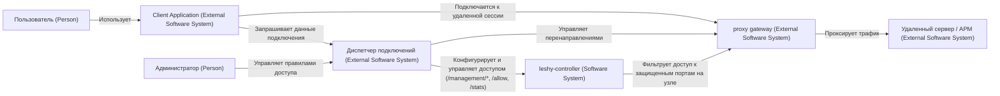
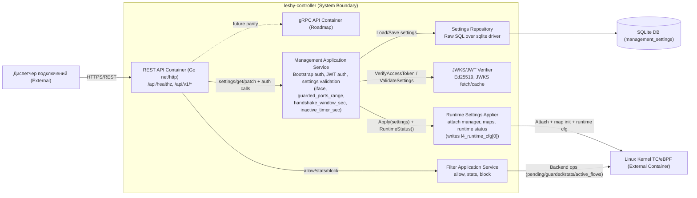
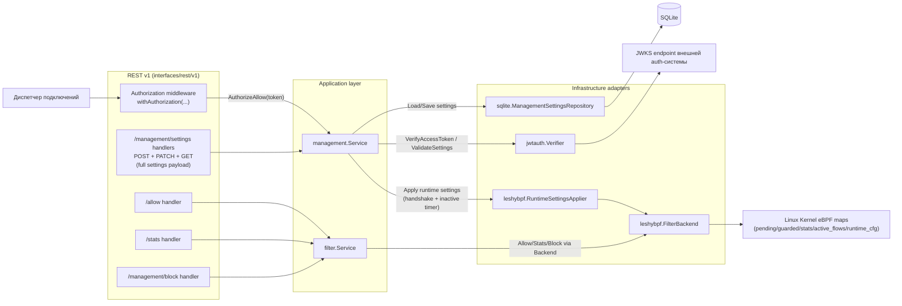

# C4: leshy-controller

Архитектура решения.

## Level 1: System Context

```mermaid
flowchart LR
    user["Пользователь (Person)"]
    client["Client Application (External Software System)"]
    admin["Администратор (Person)"]
    dispatcher["Диспетчер подключений (External Software System)"]
    leshy["leshy-controller (Software System)"]
    proxy["proxy gateway (External Software System)"]
    remote["Удаленный сервер / АРМ (External Software System)"]

    user -->|"Использует"| client
    client -->|"Запрашивает данные подключения"| dispatcher
    admin -->|"Управляет правилами доступа"| dispatcher
    dispatcher -->|"Конфигурирует и управляет доступом (/management/*, /allow, /stats)"| leshy
    dispatcher -->|"Управляет перенаправлениями"| proxy
    client -->|"Подключается к удаленной сессии"| proxy
    proxy -->|"Проксирует трафик"| remote
    leshy -->|"Фильтрует доступ к защищенным портам на узле"| proxy
```

## Level 2: Container

```mermaid
flowchart LR
    dispatcher["Диспетчер подключений (External)"]
    kernel["Linux Kernel TC/eBPF (External Container)"]
    db[("SQLite DB (management_settings)")]

    subgraph leshy["leshy-controller (System Boundary)"]
        api["REST API Container (Go net/http)\n/api/healthz, /api/v1/*"]
        grpc["gRPC API Container (Roadmap)"]
        mgmt["Management Application Service\nBootstrap auth, JWT auth, settings validation\n(iface, guarded_ports_range,\nhandshake_window_sec, inactive_timer_sec)"]
        filt["Filter Application Service\nallow, stats, block"]
        verifier["JWKS/JWT Verifier\nEd25519, JWKS fetch/cache"]
        repo["Settings Repository\nRaw SQL over sqlite driver"]
        runtime["Runtime Settings Applier\nattach manager, maps, runtime status\n(writes l4_runtime_cfg[0])"]
    end

    dispatcher -->|"HTTPS/REST"| api
    api -->|"settings/get/patch + auth calls"| mgmt
    api -->|"allow/stats/block"| filt
    api -.->|"future parity"| grpc

    mgmt -->|"Load/Save settings"| repo
    repo --> db

    mgmt -->|"VerifyAccessToken / ValidateSettings"| verifier
    mgmt -->|"Apply(settings) + RuntimeStatus()"| runtime
    runtime -->|"Attach + map init + runtime cfg"| kernel
    filt -->|"Backend ops (pending/guarded/stats/active_flows)"| kernel
```

## Level 3: Component (Control Plane)

```mermaid
flowchart LR
    ext["Диспетчер подключений"]
    sqlite[("SQLite")]
    jwks["JWKS endpoint внешней auth-системы"]
    kernel["Linux Kernel eBPF maps\n(pending/guarded/stats/active_flows/runtime_cfg)"]

    subgraph rest["REST v1 (interfaces/rest/v1)"]
        mw["Authorization middleware\nwithAuthorization(...)"]
        hsettings["/management/settings handlers\nPOST + PATCH + GET\n(full settings payload)"]
        hallow["/allow handler"]
        hstats["/stats handler"]
        hblock["/management/block handler"]
    end

    subgraph app["Application layer"]
        mgmt["management.Service"]
        filt["filter.Service"]
    end

    subgraph infra["Infrastructure adapters"]
        repo["sqlite.ManagementSettingsRepository"]
        verifier["jwtauth.Verifier"]
        applier["leshybpf.RuntimeSettingsApplier"]
        backend["leshybpf.FilterBackend"]
    end

    ext --> mw
    mw -->|"AuthorizeAllow(token)"| mgmt
    hsettings --> mgmt
    hallow --> filt
    hstats --> filt
    hblock --> filt

    mgmt -->|"Load/Save settings"| repo
    repo --> sqlite
    mgmt -->|"VerifyAccessToken / ValidateSettings"| verifier
    verifier --> jwks
    mgmt -->|"Apply runtime settings\n(handshake + inactive timer)"| applier
    applier --> backend
    backend --> kernel
    filt -->|"Allow/Stats/Block via Backend"| backend
```
